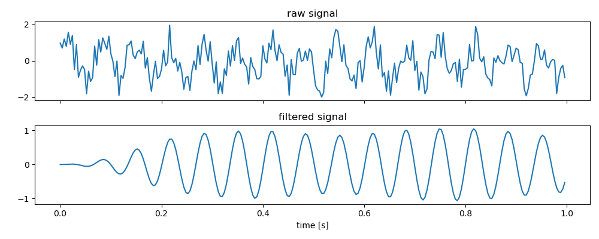

# ProcessingNodes

[](https://github.com/ClinicalNeurotechnologyLab/ProcessingNodes/actions/workflows/python-package.yml)

> [!IMPORTANT]
> This project is currently at a very early stage. Fundamental and breaking changes may occur over the next releases.

ProcessingNodes is a framework for online and offline time series signal processing.

It divides each signal processing step into one unit, a _ProcessingNode_. Multiple of such _ProcessingNodes_ can be combined and form a _ProcessingPipeline_, which this way can include a whole chain of signal processing steps.

It also features a collection of ready-to-use _ProcessingNodes_, each implementing a common signal processing method, e.g. IIR filter, spectral estimation, dimensionality reduction, etc.   

While this package may be useful for any kind of signal processing, it was developed in the context of biosignal processing, such as electromyography (muscle activity) or electroencephalography (brain activity). In consequence, it might be heavily influenced by some concepts predominantly found in the biosignal processing domain.


### Example 01: processing data using a single ProcessingNode

[examples/example01.py](./examples/example01.py)
```python
import numpy as np
import matplotlib.pyplot as plt
from processingnodes.nodes import IIRFilterNode

# use a sampling frequency of 250Hz and a sinusoid of 15Hz
fs = 250
f_sine = 15

# generate the time series data
timestamps = np.arange(fs) / fs
noisy_signal = np.sin(2*np.pi*f_sine*timestamps) + 2 * np.random.random(size=timestamps.size) 

# create an IIR filter node with a bandpass from 13 to 17 Hz
node = IIRFilterNode(
    in_channel_labels=["Ch1"],
    sfreq=fs,
    order=3,
    btype="bandpass",
    ftype="butter",
    fpass=[13, 17],
    fstop=[10, 20]
)

# apply the filter
filtered_sine, _ = node.process(noisy_signal)

# plot results
fig, axes = plt.subplots(2, 1, sharex="all", figsize=[10,4])

axes[0].plot(timestamps, noisy_signal)
axes[1].plot(timestamps, filtered_sine)

axes[0].set_title("raw signal")
axes[1].set_title("filtered signal")
plt.xlabel("time [s]")
plt.tight_layout()
plt.show()
```



